# 0. 프로젝트 개요
HTML, CSS, JavaScript, PHP, AWS EC2의 기본 개념을 학습하고, 이를 바탕으로 제작한 개인 프로젝트입니다. 

# 1. 프로젝트 설명
기본적인 화면 구성은 HTML, CSS, 그리고 JavaScript를 활용하였습니다.  

PHP : 데이터베이스와의 연동, CRUD를 위해 활용하였습니다.  
AWS EC2 : 서비스를 항상 구동시켜놓기 위하여 활용하였습니다. 

# 2. 기능 설명
## 2-1. 첫 화면
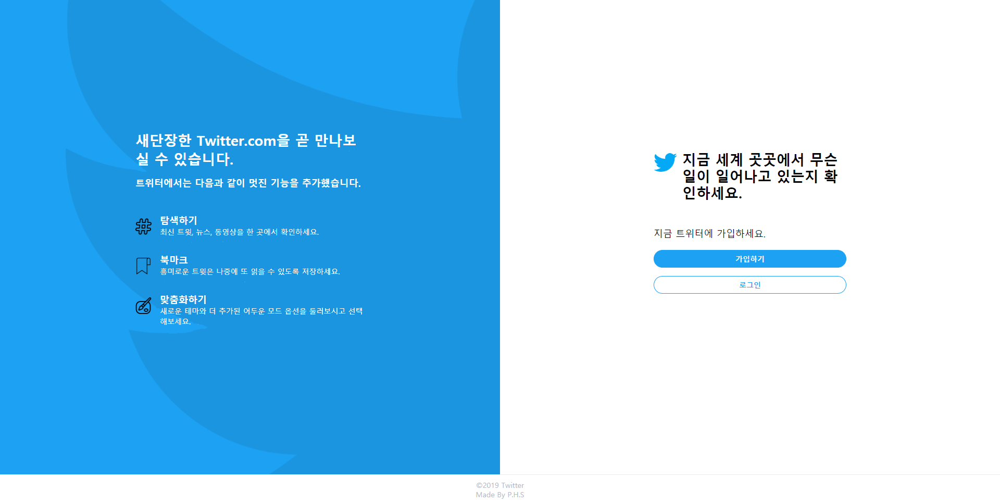 
twitter-clone의 첫 화면입니다. 

## 2-2. 회원 관리
### 2-1-1. 회원 가입
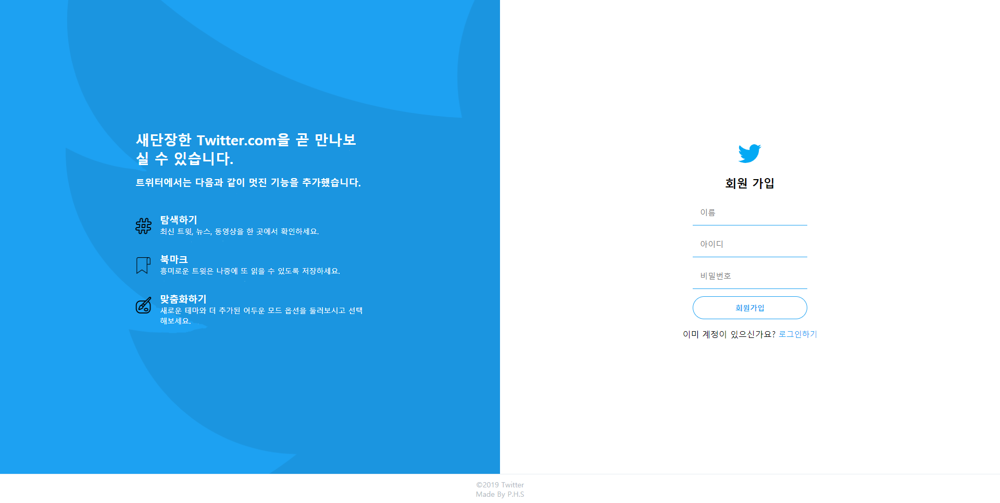 
간단하게 이름, 아이디, 비밀번호만 입력받아 회원가입을 진행합니다. 

### 2-1-2. 로그인
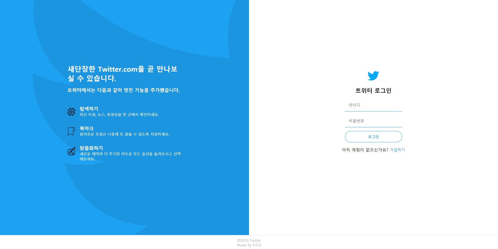 
아이디, 비밀번호를 입력받아 로그인이 진행됩니다. 

### 2-1-3. 회원 정보 수정
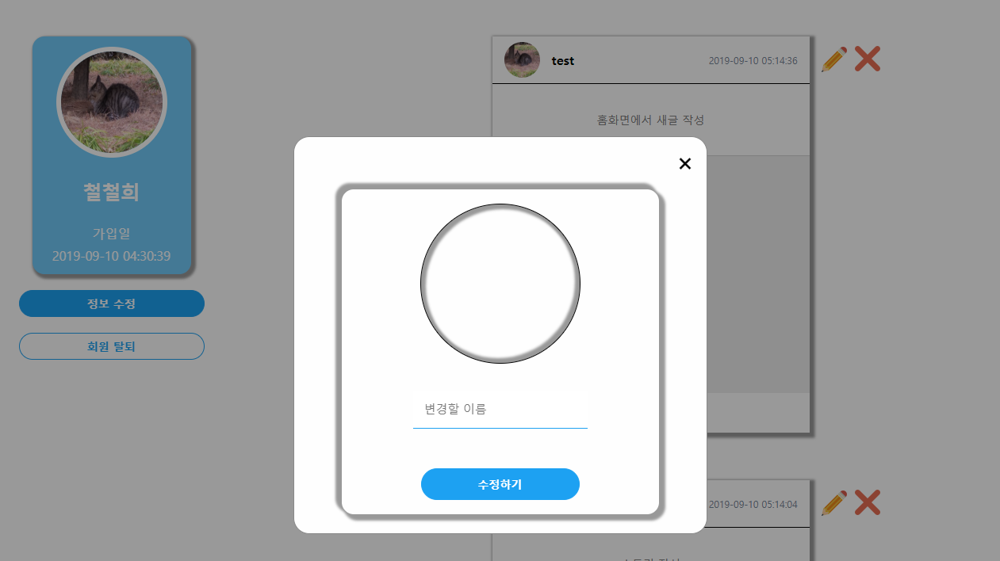 
정보 수정 버튼을 누르면 프로필 사진과 이름을 수정할 수 있는 Modal pop-up창이 뜨게 됩니다. 
변경할 정보를 입력하고 수정하기 버튼을 클릭하면 수정 작업이 수행됩니다. 

### 2-1-4. 회원 탈퇴
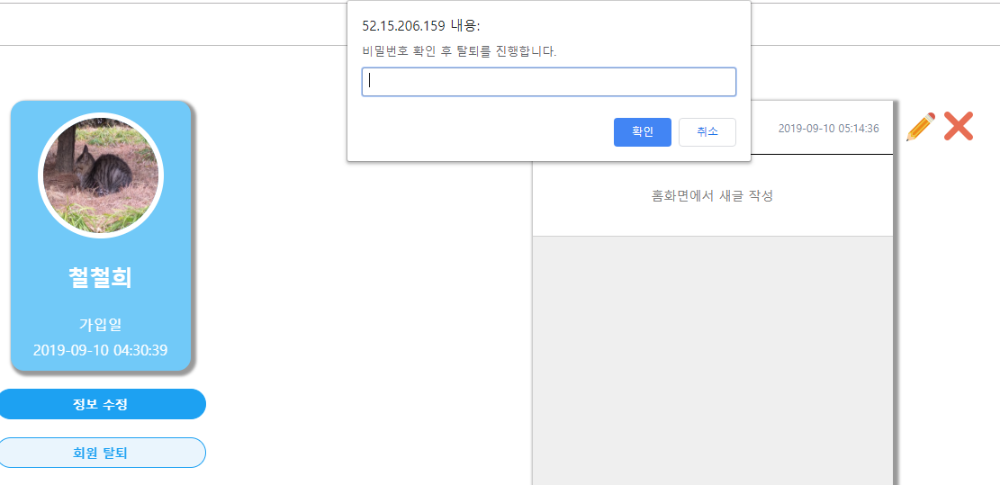 
회원 탈퇴 버튼을 누르면 비밀번호를 확인받는 prompt창을 띄웁니다.  
해당 prompt창에서 입력받은 데이터와 현재 로그인된 회원의 비밀번호를 비교 작업을 거쳐 회원 탈퇴를 수행하게 됩니다. 

## 2-2. 게시물 관리
### 2-2-1. 스토리 조회
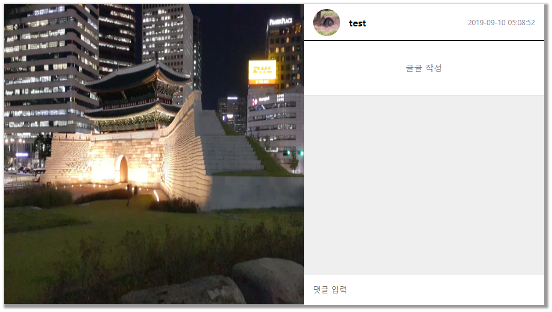 
사진이 있는 스토리일 경우 위와 같이 보이게 되며, 
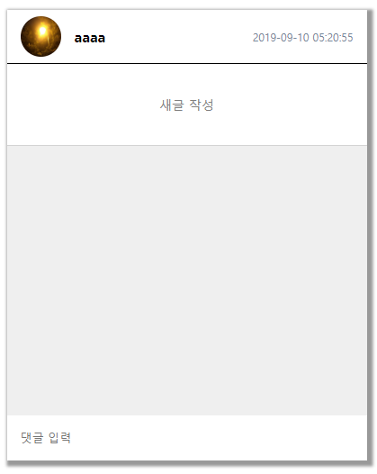 
사진이 없는 스토리일 경우 위와 같이 보이게 됩니다. 

### 2-2-2. 스토리 작성
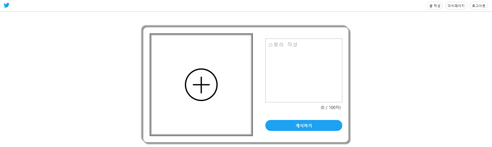 
스토리 작성하는 화면입니다. 
사진이나 문장을 작성하여 게시하기 버튼을 클릭하면 작업을 수행하게 됩니다. 
문장은 최대 100자 까지만 입력받도록 하였습니다. 

### 2-2-3. 스토리 수정
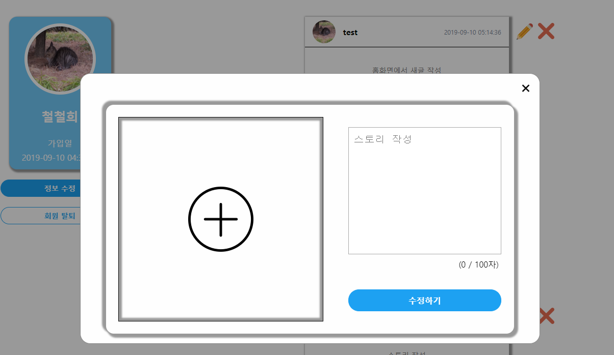 
게시물 오른쪽에 있는 연필 버튼을 클릭하게 되면 위와 같이 게시물을 수정할 수 있는 
Modal pop-up창이 뜨게 됩니다. 변경할 정보를 입력하고 수정하기 버튼을 클릭하면, 
수정 작업이 수행됩니다. 

### 2-2-4. 스토리 삭제
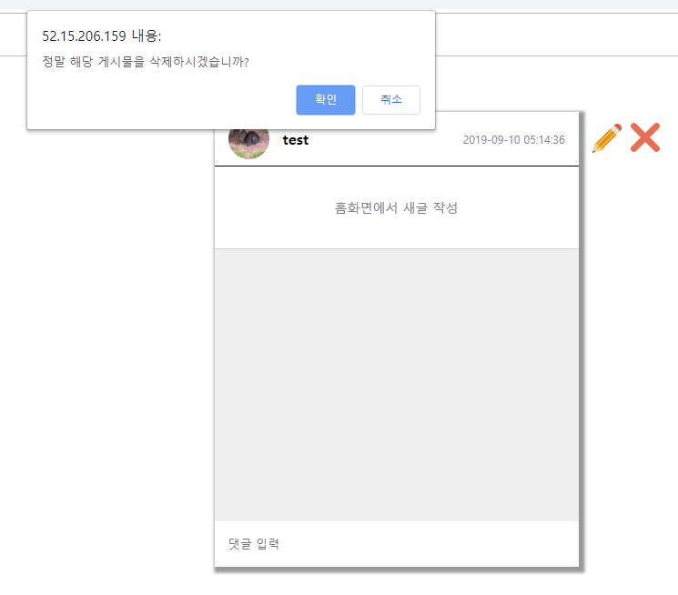 
게시물 오른쪽에 있는 엑스 버튼을 클릭하게 되면 위와 같이 confirm 창이 뜨게 됩니다. 
해당 confirm 창에서 확인을 누르면 스토리 삭제 작업이 수행됩니다. 

### 2-2-5. 댓글 작성
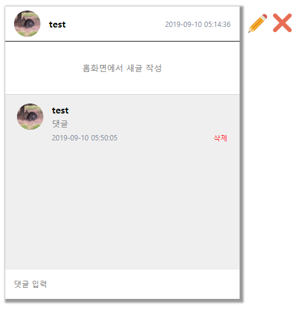 
스토리에서 댓글 입력 부분에 문장을 입력하고 엔터를 누르면 댓글 작성 작업이 수행됩니다. 

### 2-2-6. 댓글 삭제
현재 로그인한 계정 정보와 댓글의 작성자가 같다면 다음과 같이 삭제 버튼이 활성화됩니다. 
 
삭제 버튼을 클릭하게 되면 다음과 같이 confirm 창이 뜨게 되며, 
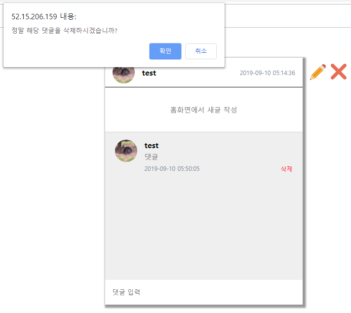 
확인을 누르면 삭제 작업이 수행됩니다. 

# 3. 동작 확인
## 실제 동작은 다음 URL에서 확인 가능합니다.
### http://52.15.206.159/index.php
